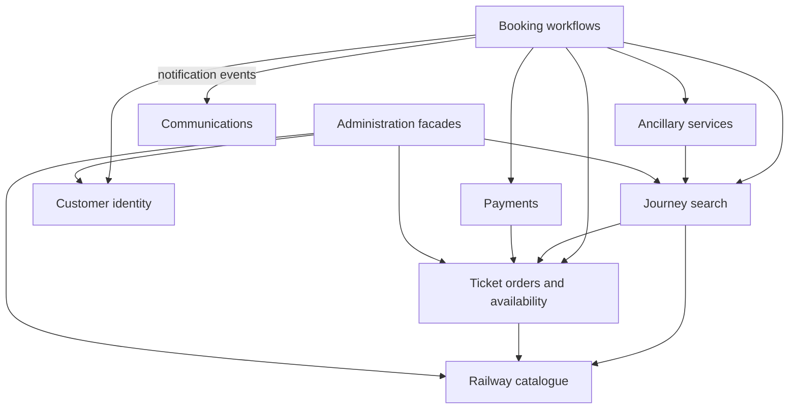
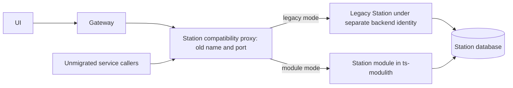

# Train Ticket: incremental migration to a modular monolith

## Current progress (4 October 2026)

The live hybrid runs 44 business modules plus one internal Trip Catalog module
in one Spring Boot 3.5.16/Java 21 host. TicketInfo is business module 43; its GET and POST contracts match
the retained legacy container, and Travel, Travel2, Preserve and PreserveOther
use its local API. WaitOrder is business module 44 with isolated MySQL persistence,
authenticated HTTP endpoints, duplicate protection, scheduled expiry and
durable booking retries through Preserve's published API.
The legacy WaitOrder service is absent from this stack, so there is no live
database to transfer or baseline to compare. The replacement retry worker uses
database leases and stable order IDs; the old PollThread is not used. See the
[WaitOrder migration results](wait-order-results.md) and [testing guide](TESTING.md).
The 40 existing HTTP routers remain reversible. TicketInfo's legacy container
is retained on port 15681 for comparison; WaitOrder is currently exposed on
the shared host's port 18080 without a port-8080 UI route. The inventory and
sequence below remain the working context map.

Auth now calls Verification Code through a published module API. Preserve and
PreserveOther call User, Assurance, Food and Consign through published APIs,
and Cancel calls User locally. The isolated candidate verified a booking with
the corresponding legacy URLs unreachable. Trip Catalog now owns the two trip
collections. Seat reads Trip Catalog, Route and Train through published APIs,
while Travel and Travel2 still use Seat for availability. The isolated candidate
matched the previous host's search and seat results and booked both trip types
with the old Seat-to-Travel HTTP URLs disabled.

## Recommendation and scope

Use **Orders as the business centre**, a new `ts-modulith` application as the deployment host, and **Station as the first migrated service**. Then migrate Orders and seat availability early. Each numbered service below is a separate implementation, test and cutover checkpoint.

The recommendation below was first made from checkout `35191344` before Docker
was available. Later stages inspected and tested the running `codewisdom/*:0.2.0`
release. There is still no measured performance result or complete migration.

The supplied PDFs are methodology references, not executable instructions. The 18-page *Methodology for Migrating from Microservices to a Modular Monolith (1)* supports domain analysis and an epicentre (§1, p.1), inventory (§2, p.2), internal interfaces and incremental routing (§4, pp.4–5). The 25-page *Methodology.pdf* expands domain analysis and dependency-aware integration order (§1, pp.1–2), inventory (§2, pp.3–4), and phased rollout, shadowing and fallback (§9, pp.19–20).

The short Station pilot is a deliberate adaptation of the documents' critical-flows-first guidance: it proves routing, database ownership and rollback before moving order state. Orders follow immediately. A centre determines business organisation; it does not have to be the first service moved or the application bootstrap reused.

## Evidence and centrality

Run `python docs/migration/analyze_dependencies.py` to regenerate the CSV inventory, source-line evidence and Mermaid graph alongside this file. The scan counts distinct callers/providers referenced by name in production Java sources. It removes block comments and full-line comments, but is a heuristic, not a Java parser. Gateway routes, tests, non-Java code, message queues, dynamic names, traffic volume and runtime reachability are excluded. Zero Java references does not prove independence.

| Candidate | Distinct Java callers | Distinct Java providers | Interpretation |
| --- | ---: | ---: | --- |
| ts-order-service | 8 | 1 | Core ticket/order state; depends on Station |
| ts-order-other-service | 8 | 1 | Parallel order implementation; also depends on Station |
| ts-station-service | 8 | 0 | Widely used reference data; good pilot |
| ts-route-service | 7 | 0 | Reference data provider |
| ts-train-service | 7 | 0 | Reference data provider |
| ts-seat-service | 6 | 3 | Depends on both order services and Config |
| ts-travel-service | 6 | 4 | Depends on Basic, Route, Train and Seat |
| ts-preserve-service | 1 | 11 | Booking orchestration; expensive first migration |
| ts-preserve-other-service | 0 | 11 | Parallel booking orchestration |

Orders have another caller outside this table: `ts-voucher-service/server.py` calls both order services using explicit hostnames and ports. Both Preserve services publish to RabbitMQ's `email` queue, consumed by Notification. Include these edges in integration and cutover tests; they are absent from the Java graph.

Choose Orders for domain importance and broad reuse, not because incoming degree alone uniquely identifies it. Preserve is the workflow orchestrator. Station is the first implementation slice. Keep the reactive gateway as a routing component during migration; placing servlet business modules inside it would mix different application stacks.

## Proposed bounded contexts

These groupings are design hypotheses inferred from code responsibilities. Validate terminology and ownership with domain knowledge; a dependency graph alone is not a DDD context map. Initially preserve former services as submodules, including the separate order/travel variants. Consolidate their models only after behaviour is characterised.

| Context | Existing services (omit `ts-` and `-service`) | Boundary |
| --- | --- | --- |
| Railway catalogue | station, route, train, price | Own reference data and pricing APIs |
| Journey search | basic, travel, travel2, route-plan, travel-plan | Compose journeys, prices and availability |
| Ticket orders and availability | order, order-other, seat, config, security | Own order state and availability/risk rules |
| Booking workflows | preserve, preserve-other, rebook, cancel, execute, wait-order | Coordinate booking and lifecycle changes through other contexts' APIs |
| Customer identity | verification-code, auth, user, contacts | Own identities, credentials and contact data; consider contacts a separate submodule |
| Payments | payment, inside-payment | Own payment/balance operations |
| Ancillary services | assurance, consign-price, consign, station-food, train-food, food, delivery, food-delivery | Keep insurance, baggage and catering as distinct internal submodules |
| Communications | notification | Own notification delivery and retry behaviour |
| Administration | five admin services | Application facades over the owning contexts; no direct repository access |
| Peripheral capabilities | voucher, avatar, news, ticket-office | Establish actual usage and rewrite into the host language if full consolidation is required |

Simplified proposed context relationships; arrows mean consumer calls provider. Providers expose explicit contracts (an Open Host Service / Published Language style); migration adapters translate legacy DTOs at the boundary. These are proposed technical relationships, not claims about current team agreements.

The Payments-to-Orders edge reflects current Inside Payment behaviour. Later consider letting booking workflows coordinate payment and order changes. Do not introduce an Orders-to-Payments dependency that creates a cycle. Keep notification delivery asynchronous with equivalent durability and retry semantics during consolidation.

## Recommended sequence

Stage 0: establish a reproducible baseline, deployment host, routing seam and measurement harness. Then execute the following order left to right, one service at a time. The order prioritises a small pilot, the order/availability core, then search and booking. Services may still call unmigrated services through HTTP adapters; dependencies need not all be local before a migration.

| Stage | Exact order | Reason and checkpoint |
| --- | --- | --- |
| 1 | 1. station | Small provider with broad integration coverage; validate admin writes, lookups and rollback |
| 2 | 2. order; 3. order-other; 4. config; 5. seat; 6. security | Consolidate order state and availability/risk reads; verify duplicate requests and concurrent bookings |
| 3 | 7. train; 8. route; 9. price; 10. basic; 11. travel; 12. travel2; 13. route-plan; 14. travel-plan | Internalise catalogue/search calls after orders and availability are local |
| 4 | 15. contacts; 16. preserve; 17. preserve-other; 18. wait-order; 19. execute | Bring the booking workflow into the host; retain remote adapters to identity and ancillary services |
| 5 | 20. payment; 21. inside-payment; 22. cancel; 23. rebook | Consolidate payment and order lifecycle; verify refunds, retries, partial failure and compensation |
| 6 | 24. assurance; 25. consign-price; 26. consign; 27. station-food; 28. train-food; 29. food; 30. delivery; 31. food-delivery; 32. notification | Remove ancillary HTTP boundaries; preserve queue delivery guarantees and suppress duplicate side effects |
| 7 | 33. verification-code; 34. auth; 35. user | Preserve tokens, sessions, roles and registration semantics; identity remains remote until this stage |
| 8 | 36. admin-basic-info; 37. admin-route; 38. admin-travel; 39. admin-order; 40. admin-user | Move thin admin facades once their providers are local |
| 9 | 41. voucher; 42. avatar; 43. news; 44. ticket-office | Verify scope and usage, then port non-Java implementations with contract tests |

All names in the table expand to `ts-<name>-service`. Gateway and UI are deployment/edge components, not business modules. `ts-common` is a library; keep its shared contract types minimal. Retire any redundant gateway hop only after the service migrations and client routing are complete. External infrastructure such as databases and brokers can remain separate while the business backend becomes one deployable process.

This is a reasoned initial order, not a measured optimum. After each stage, compare observed call frequency, latency and failure risk. Move a dependency earlier if evidence shows a significant benefit, recording the reason. Do not combine migration with changes to business semantics merely to follow the table.

## Strangler routing: both client and service traffic

The pattern is usually described for extracting services, but its gradual replacement and routing mechanism also supports consolidation. See [Strangler Fig](https://martinfowler.com/bliki/StranglerFigApplication.html).

Current source has UI NGINX forwarding `/api/v1/` to the gateway; the gateway uses `lb://` service names. Java callers use load-balanced RestTemplate calls such as `http://ts-station-service`. Some non-Java callers use DNS and explicit ports. Changing the gateway alone will miss internal callers.

Recommended migration seam: a compatibility proxy for each migrated service, reachable under the old service identity and old port. It forwards unchanged paths/headers to either the legacy implementation or `ts-modulith`. Configure both Nacos discovery and any Docker/Kubernetes DNS aliases to resolve that identity to the proxy. Register the legacy implementation under a distinct backend identity; do not leave it registered beside the proxy under the original identity, where clients could bypass the switch. Verify Nacos health registration and discovery-cache convergence.

Only one implementation handles authoritative writes at a time. The two arrows into the database show alternative ownership modes. Read comparisons can use a snapshot or read-only credentials; merely using GET is insufficient if application startup seeders write data. Use isolated data for write comparisons. Never replay payment, email or booking writes against both live implementations.

For Station, retain `/api/v1/stationservice/**` and legacy port `12345` at the compatibility seam. Test both the gateway route and direct load-balanced calls. A routing alternative is to explicitly externalise and reconfigure every caller target, but the proxy gives a reusable single switch for each legacy identity. The proxy requires implementation and deployment work; it does not already exist here.

Once both caller and provider are inside the host, replace their HTTP call with a module API. Example: Orders uses `StationLookup`; its temporary HTTP adapter calls the compatibility endpoint, and its local adapter invokes Station's exported application service. Do not call another module's controller, entity or repository. Preserve response/error semantics in adapters, and explicitly test changes in exception and transaction propagation after replacing HTTP.

## First migration: Station acceptance plan

1. Record the exact running image/commit, database schema, seed dataset and topology. Build the baseline from the chosen source revision and run search, booking, payment/cancel and administration smoke tests.
2. Create a host with one application bootstrap and a Station module under a unique package such as `trainticket.station`. Station and Basic currently share the `fdse.microservice` package root, so blindly widening component scanning risks collisions. Scope entities, repositories, security and configuration to their modules.
3. Keep the Station database and schema unchanged at first. If later modules retain separate databases, configure explicit module-specific persistence units/transaction managers. A single JVM does not make multiple database writes atomic. Defer physical database consolidation to a separate step.
4. Gate Station's `InitData` runner behind a development-only profile. Replace implicit production schema changes (`ddl-auto: update`) with a controlled migration/validation policy before cutover. Preserve IDs and existing data.
5. Characterise all Station endpoints: welcome; list; create (HTTP 201); update; delete; name-to-ID and ID-to-name lookups; both batch POST lookup endpoints. Compare status, headers, JSON envelope, missing-data behaviour, duplicates, Unicode/spaces, authentication and authorisation.
6. Run those contracts against the legacy service and module using identical seeded snapshots. Exercise real callers: Basic, both Orders, both Preserve services, Admin Basic Info, Admin Route and Admin Travel. Include end-to-end search and booking flows.
7. Switch the compatibility proxy to the module in the integration environment. Confirm requests reach the host from both ingress and service callers, and no authoritative Station writes reach the legacy service. Drain in-flight writes during switching.
8. Rehearse rollback: drain module writes, switch routing back, verify the legacy service can read records created/updated by the module, and run the same workflow checks. Keeping the schema unchanged makes this practical; future schema changes require their own rollback/data reconciliation plan.
9. Record functional results, p50/p95/p99 latency, throughput, errors, CPU/RAM, number of HTTP calls, and cutover/rollback duration. Promote only after contracts and critical flows pass, data invariants hold, routing is verified, and agreed performance limits are met. Select numeric limits from the baseline before running the experiment.

## Framework and deployment prerequisites

The parent uses Spring Boot `2.3.12.RELEASE` and Spring Cloud `Hoxton.SR12`. Spring Modulith's documented compatibility matrix targets newer Boot lines; do not simply add its current starter to this parent. See [compatibility](https://docs.spring.io/spring-modulith/reference/appendix.html) and [module verification](https://docs.spring.io/spring-modulith/reference/verification.html).

For an experiment isolating architectural effects, first build a modular monolith on the existing stack with explicit Java module APIs and architecture rules using a compatible ArchUnit version. Treat the framework/JDK upgrade as a separately measured change. If Spring Modulith the framework is required from iteration one, give the new host its own compatible Boot/Modulith dependency management, validate the required JDK, migrate legacy APIs/dependencies as needed, and label the framework change as a confounder in performance comparisons. The microservices can remain on their current stack while the new host is upgraded.

Resolve these observed deployment discrepancies before claiming a working hybrid baseline:

- Root `docker-compose.yml` references `ts-ticketinfo-service` and `ts-food-map-service` build directories absent from this checkout.
- Station source is configured for MySQL and Nacos, while root Compose defines `ts-station-mongo` and does not provide the corresponding Station MySQL/Nacos services.
- UI NGINX expects `ts-gateway-service:18888`, but the root Compose file does not declare that gateway.
- RabbitMQ is commented out in the root Compose file, although booking/notification sources use an email queue.

These findings concern the checked-in root Compose file. An external cluster or other deployment may supply the missing infrastructure; inspect the actual runtime before changing it. Establish one migration Compose/cluster configuration that matches the current source and use it for both baseline and hybrid experiments.

## Repeatable experiment for every service

Maintain a stage manifest containing commit, image digests, migrated services, routing targets, database versions and migration state. For each step:

1. Unit and contract tests for the migrated module.
2. Module-boundary checks: allowed APIs only, no cross-module repositories or cycles.
3. Hybrid integration tests with real remaining services and databases, including timeouts and dependency failure.
4. Critical end-to-end scenarios and data invariants. For order/payment changes, test duplicate requests, concurrent seat allocation, refund totals and recovery from partial failures; document pre-existing defects separately.
5. Cutover and rollback rehearsal with writes created after cutover.
6. Repeat fixed workloads on the baseline and hybrid topology with matched datasets, warm-up, resources and concurrency. Report multiple runs and variability. Record container counts and total system resources as well as host resources so consolidation gains are measurable.

Save evidence at each checkpoint; do not claim improvement from degree counts alone. Retire each legacy service only after the hybrid gate and rollback rehearsal pass. The final acceptance condition is one backend deployable, explicit module boundaries, no internal service-to-service HTTP, preserved external contracts, and verified data ownership.

### Direct module calls checkpoint

The 45-module host now calls published module APIs for all Java in-host collaborations. The last HTTP adapters were Seat to Travel/Travel2, Travel/Travel2 to TicketInfo, Auth to Verification Code, Cancel to User, and Preserve/PreserveOther to TicketInfo, User, Assurance, Food and Consign. The old URL properties and HTTP clients were removed from the host. The gateway and compatibility proxies still expose the existing HTTP contracts to the browser and legacy processes; they remain the side-by-side rollback seam. RabbitMQ and databases remain external integrations. Run `python docs/migration/verify_direct_modules_candidate.py` before upgrading the host with `python docs/migration/prepare_direct_modules.py`.
